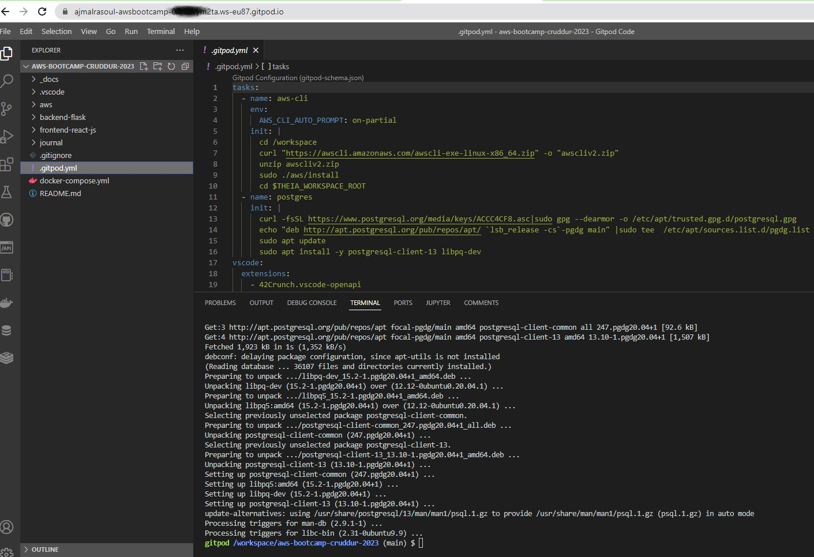
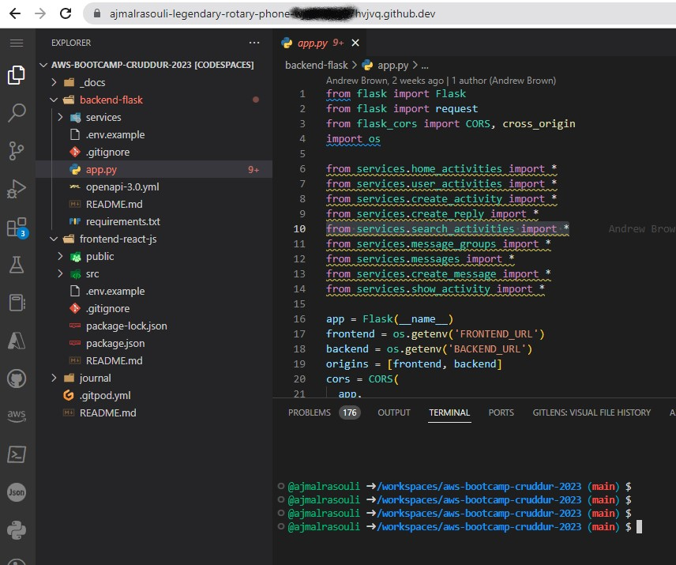

# Week 1 — App Containerization

## Required Homework/Tasks

## Cloud Development Environment (CDE)

### Gitpod
#### Up to 50 hours of usage/month

### GitHub Codespaces
#### Up to 60 hours of usage/month

### AWS Cloud9: I am not using AWS Cloud9 
#### Avoid using Cloud9 in case of free tier instance in use for other purpose.
It's a tricky part if you are using your free tier instance somewhere else in the account avoid AWS Cloud9 because at the end of month the 
bill will be aggregated hours of uses so even if you use T2 micro with Cloud9 and you are using T2 micro or T3 micro for some other purposes
the bill will be there so, make sure to avoid.

### Common Docker Commands

## Homework Challenges

#### Run the dockerfile CMD as an external script
#### Push and tag a image to DockerHub (they have a free tier)
#### Use multi-stage building for a Dockerfile build
#### Implement a health check in the V3 Docker compose file
#### Research best practices of Dockerfiles and attempt to implement it in your Dockerfile
#### Learn how to install Docker on your local machine and get the same containers running outside of Gitpod / Codespaces
#### Launch an EC2 instance that has docker installed, and pull a container to demonstrate you can run your own docker processes. 
