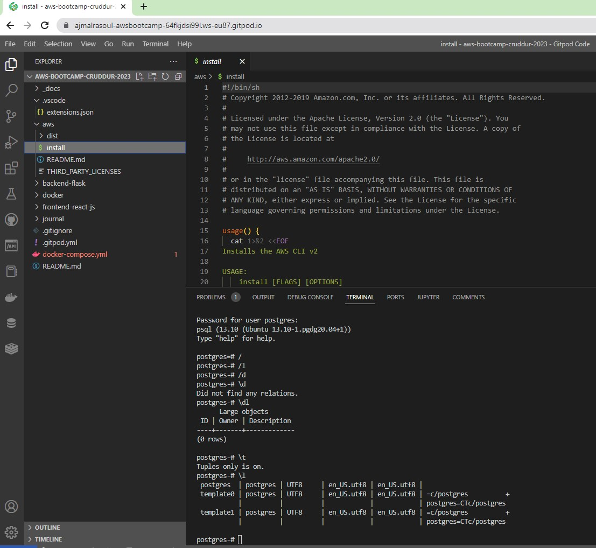

# Week 1 — App Containerization

## Required Homework/Tasks

### Docker
The best way to describe Docker is to use the phrase from the Docker web site—Docker is
“an open source project to pack, ship and run any application as a lightweight container.”
Thus the idea of Docker is to have an abstraction layer that allows the application
developers to package any application and then let the containerization technology take
care of the deployment aspects to any infrastructure.

### Why do we need containerized applications?
Containerization allows developers to create and deploy applications faster and more securely. With traditional methods, code is developed in a specific computing environment which, when transferred to a new location, often results in bugs and errors.


### What is DockerHub?
Understanding Docker Hub Registry
registry service that is cloud-based; the Docker Hub Registry allows the user to do the following:

- Link to code repositories
- Build images and test them
- Stores images that are manually pushed
- Links to Docker Cloud to help deploy images to a host.

In summary, we can understand the Docker Hub Registry as a tool that offers a centralized resource for discovering a container image, managing distribution and change, facilitating collaboration between the user and team, and automating workflow throughout the development pipeline.


## Cloud Development Environment (CDE)


### Gitpod
#### Up to 50 hours of usage/month


### GitHub Codespaces
#### Up to 60 hours of usage/month


### AWS Cloud9: I am not using AWS Cloud9 
#### Avoid using Cloud9 in case of free tier instance in use for other purpose.
It's a tricky part if you are using your free tier instance somewhere else in the account avoid AWS Cloud9 because at the end of month the 
bill will be aggregated hours of uses so even if you use T2 micro with Cloud9 and you are using T2 micro or T3 micro for some other purposes
the bill will be there so, make sure to avoid.


### Common Docker Commands
- docker run – Used for running a command in a new container
- docker start – For starting one or more stopped containers
- docker stop – For stopping one or more running containers
- docker build – Used for building an image form in a Docker file
- docker pull – For pulling an image or a repository from a registry
- docker push – Given for pushing an image or a repository to a registry
- docker export – For exporting a container’s filesystem as a tar archive
- docker exec – To run a command in a run-time container
- docker search – For searching the Docker Hub for images
- docker volume- To create and attach to containers to store data.
- docker network- allows you to attach a container to as many networks as you like. You can also attach an already running container.
- docker attach – To attach to a running container
- docker commit – For creating a new image from a container’s changes
- docker daemon – Having listened for Docker API requests, the Docker daemon (dockerd) manages Docker objects. These include networks, volumes, containers, and images. It also communicates with other daemons when managing Docker services.
- docker Images – A read-only template, an image has instructions that are used to create a Docker container. Many times, images are based on other images and carry some degree of customization. An image-based on ubuntu can install the Apache web server, your application, and the configuration details that the application needs to run.

#### Setup Postgres 
Postgres is “a powerful, open-source object-relational database system with over 30 years of active development that has earned it a strong reputation for reliability, feature robustness, and performance.”

Like other relational databases, you can model almost any data and its relationships using tables, keys, constraints, triggers, and more!

Postgres is currently used in production by many modern technology companies, be it small startups or large organizations such as Apple, Instagram, Twitch, and Reddit.

```
#Create the file repository configuration:
sudo sh -c 'echo "deb http://apt.postgresql.org/pub/repos/apt $(lsb_release -cs)-pgdg main" > /etc/apt/sources.list.d/pgdg.list'

#Import the repository signing key:
wget --quiet -O - https://www.postgresql.org/media/keys/ACCC4CF8.asc | sudo apt-key add -

#Update the package lists:
sudo apt-get update

#Install the latest version of PostgreSQL.
#If you want a specific version, use 'postgresql-12' or similar instead of 'postgresql':
sudo apt-get -y install postgresql
```





#### Setup Snyk
Snyk (pronounced sneak) is a developer security platform for securing code, dependencies, containers, and infrastructure as code.


## Homework Challenges

#### Run the dockerfile CMD as an external script
Assuming that your docker container is up and running, you can run commands as:
```
#docker exec mycontainer /bin/sh -c "cmd1;cmd2;...;cmdn"
docker exec ea660ec256cf /bin/sh -c "echo 'Hello world'"
```


#### Push and tag a image to DockerHub

- Create a docker hub account. 


- Pull a docker image


- create a custom tag to docker image


#### Use multi-stage building for a Dockerfile build
What are the benefits of multi-stage builds in Docker?
Some of the benefits of having multi-stage builds in Docker are as follows:


1. Multi-stage builds are ideal for deploying production-ready applications.
2. Multi-stage builds work with only one Dockerfile.
3. It allows us to build smaller images, and Dockerfile separates them into various build stages.
4. We have a uniform syntax to learn.
5. Muti-stage builds work on local machines as well as on the CI (Continuous Integration) server.
6. The multi-stage builds usually work with only one Dockerfile. In this Dockerfile, we use multiple FROM statements to define various stages of builds.
7. Using multi-stage builds, we can limit the size of the image we create. In single-stage builds, with each instruction executed, a new layer gets added to the image, making it bulky.
8. With multi-stage builds, we can name a particular stage, stop the build at a specific stage, use an external image, or switch between stages.

```
# 1 choose a compiler OS
FROM golang:alpine AS builder
# 2 (optional) label the compiler image
LABEL stage=builder
# 3 (optional) install any compiler-only dependencies
RUN apk add --no-cache gcc libc-dev
WORKDIR /workspace
# 4 copy all the source files
COPY . .
# 5 build the GO program
RUN CGO_ENABLED=0 GOOS=linux go build -a
# 6 choose a runtime OS
FROM alpine AS final
# 7 
ARG ENV
WORKDIR /
# 8 copy from builder the GO executable file
COPY --from=builder /workspace/mygoexecutable .
COPY --from=builder /workspace/_envs/env_$ENV.yaml ./_envs/
# 9 execute the program upon start 
CMD [ "./mygoexecutable" ]
```
#### Implement a health check in the V3 Docker compose file
To identify potential software bugs as early as possible, Docker health checks can be implemented quickly. Consider adding a health check to your next Dockerfile.

It is easier to diagnose a misbehaving container when it is marked with the HEALTHCHECK instruction. The reliability of the workload can be analyzed irrespective of the container's "running" status.

All commands that issue an exit code of 0 or 1 are compatible with health checks.

A docker health check is a command used to test the health of a container. Health checks help ensure that a container is running as expected and can be used to prevent or diagnose problems.

Healthcheck Code:
```
FROM nginx
COPY index.html /usr/share/nginx/html/index.html
HEALTHCHECK CMD curl --fail http://localhost:80
```


#### Research best practices of Dockerfiles and attempt to implement it in your Dockerfile
list of Docker security best practices

#1 Avoid unnecessary privileges
#Rootless containers

```
FROM alpine:3.12
# Create user and set ownership and permissions as required
RUN adduser -D myuser && chown -R myuser /myapp-data
# ... copy application files
USER myuser
ENTRYPOINT ["/myapp"]
```


#2 Don’t bind to a specific UID
```
...
RUN mkdir /myapp-tmp-dir && chown -R myuser /myapp-tmp-dir
USER myuser
ENTRYPOINT ["/myapp"]
```

#3 Make executables owned by root and not writable
It is a Dockerfile best practice for every executable in a container to be owned by the root user, even if it is executed by a non-root user and should not be world-writable.

```
WORKDIR $APP_HOME
COPY --chown=app:app app-files/ /app
USER app
ENTRYPOINT /app/my-app-entrypoint.sh
```

#4 Reduce attack surface
It is a Dockerfile best practice to keep the images minimal.
Avoid including unnecessary packages or exposing ports to reduce the attack surface. The more components you include inside a container, the more exposed your system will be and the harder it is to maintain, especially for components not under your control.

#5 Multistage builds
Make use of multistage building features to have reproducible builds inside containers.

```
#This is the "builder" stage
FROM golang:1.15 as builder
WORKDIR /my-go-app
COPY app-src .
RUN GOOS=linux GOARCH=amd64 go build ./cmd/app-service
#This is the final stage, and we copy artifacts from "builder"
FROM gcr.io/distroless/static-debian10
COPY --from=builder /my-go-app/app-service /bin/app-service
ENTRYPOINT ["/bin/app-service"]
```

#### Launch an EC2 instance that has docker installed, and pull a container to demonstrate you can run your own docker processes. 
```
sudo yum update -y
sudo amazon-linux-extras install docker
sudo service docker start
sudo usermod -aG docker ec2-user
sudo docker build -t hello-world .
docker run -t -i -p 80:80 hello-world
```


